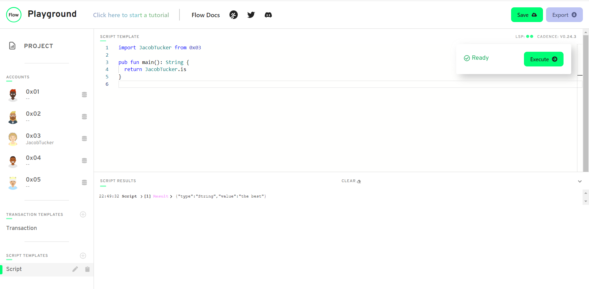
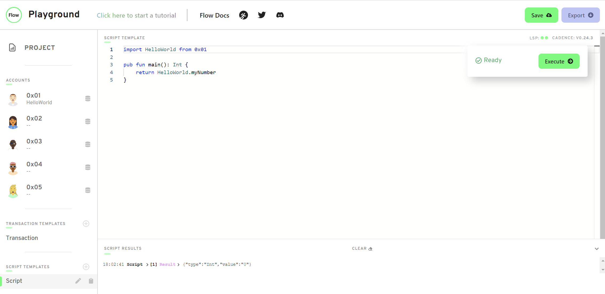
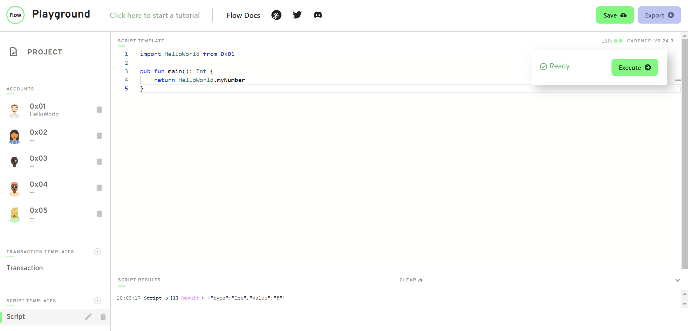

## Chapter 1

### Day 1

**1. Explain what the Blockchain is in your own words. You can read this to help you, but you don't have to: https://www.investopedia.com/terms/b/blockchain.asp******

A public database that is not owned by anyone and that anyone can store stuff inside of.

**2. Explain what a Smart Contract is. You can read this to help you, but you don't have to: https://www.ibm.com/topics/smart-contracts**

A program that one can deploy onto the Blockchain and people can interact with.

**3. Explain the difference between a script and a transaction.**

Scripts do not cost money. Scripts can only view data on the blockchain.

Transactions cost money. Transactions can view or change data on the blockchain.

### Day 2

**1. What are the 5 Cadence Programming Language Pillars?**

Safety and Security, Clarity, Approachability, Developer Experience, Resource Oriented Programming

**2. In your opinion, even without knowing anything about the Blockchain or coding, why could the 5 Pillars be useful (you don't have to answer this for #5)?**

Safety and Security: Protects me from malicious Cadence programmers.

Clarity: We can verify that a person's smart contract is safe because we can read it easily.

Approachability: If I know other languages, Cadence might be easier for me to learn.

Developer Experience: I can see why my contract is failing and fix it easily.

## Chapter 2

### Day 1

**1. Deploy a contract to account 0x03 called "JacobTucker". Inside that contract, declare a constant variable named is, and make it have type String. Initialize it to "the best" when your contract gets deployed.**

```
access(all) contract JacobTucker {
    access(all) let is: String

    init() {
        self.is = "the best"
    }
}
```

**2. Check that your variable is actually equals "the best" by executing a script to read that variable. Include a screenshot of the output.**



### Day 2

**1. Explain why we wouldn't call changeGreeting in a script.**

Scripts cannot change data on the blockchain/in a smart contract.

**2. What does the AuthAccount mean in the prepare phase of the transaction?**

AuthAccount is the person signing the transaction. This is the person who pays for the transaction. When you sign a transaction using the AuthAccount, the transaction can access the data in your account.

**3. What is the difference between the prepare phase and the execute phase in the transaction?**

Purpose of prepare phase: to access the information/data in your account

Purpose of execute phase: to call functions to view/change the data on the blockchain

**4. This is the hardest quest so far, so if it takes you some time, do not worry! I can help you in the Discord if you have questions.**

- **Add two new things inside your contract:**
    - **A variable named myNumber that has type Int (set it to 0 when the contract is deployed)**

    - **A function named updateMyNumber that takes in a new number named newNumber as a parameter that has type Int and updates myNumber to be newNumber**


```
pub contract HelloWorld {
    pub var greeting: String
    pub var myNumber: Int

    pub fun changeGreeting(newGreeting: String) {
        self.greeting = newGreeting
    }

    pub fun updateMyNumber(newNumber: Int) {
      self.myNumber = newNumber
    }

    init() {
        self.greeting = "Hello, World!"
        self.myNumber = 0
    }
}
```

**- Add a script that reads myNumber from the contract**
```
import HelloWorld from 0x01

pub fun main(): Int {
    return HelloWorld.myNumber
}
```


**- Add a transaction that takes in a parameter named myNewNumber and passes it into the updateMyNumber function. Verify that your number changed by running the script again.**

```
import HelloWorld from 0x01

transaction(myNewNumber: Int) {

  prepare(signer: AuthAccount) {}

  execute {
    HelloWorld.updateMyNumber(newNumber: myNewNumber)
  }
}
```
Running script before running the transaction:

Running script after running the transaction:


### Day 3

**1. In a script, initialize an array (that has length == 3) of your favourite people, represented as Strings, and log it.**
```
pub fun main(){
    var arr: [String] = ["Jacob", "Agatha", "Maori"]
    log(arr)
}
```

**2. In a script, initialize a dictionary that maps the Strings Facebook, Instagram, Twitter, YouTube, Reddit, and LinkedIn to a UInt64 that represents the order in which you use them from most to least. For example, YouTube --> 1, Reddit --> 2, etc. If you've never used one before, map it to 0!**
```
pub fun main(){
    var dic: {String: Int} = {"Facebook": 0, "Instagram": 0, "Twitter": 0, "YouTube": 0, "Reddit": 0, "LinkedIn": 0}
    log(dic)
}
```


**3. Explain what the force unwrap operator ! does, with an example different from the one I showed you (you can just change the type).**

The force unwrap operator is an operator that we use on an expression of type optional to obtain the expression as a non-optional type. If the value of the expression on which we use the force unwrap operator is null, then the program aborts.

For example, take this script:
```
pub fun main() {
    let thing: {Int: Int} = {3: 1, 5: 2, 2: 3}

    log(thing[3]!)
}
```
`thing[3]` here is an `Int?` type. If we use the force unwrap operator on `thing[3]`, we'll either get a value of type `Int` or the program will abort. Thankfully, `thing[3]!` is equal to 1 because 3 maps to 1 in the `thing` dictionary.

Now, take this script:
```
pub fun main() {
    let thing: {Int: Int} = {3: 1, 5: 2, 2: 3}

    log(thing[6]!)
}
```
`thing[6]` here is an `Int?` type. If we use the force unwrap operator on `thing[6]`, we'll again either get a value of type `Int` or the program will abort. Unfortunately, the program aborts because 6 does not map to anything in the `thing` dictionary (in other words, `thing[6]` was nil).


**4.**

* **What the error message means**: The return type must be `String`, but `String?` is being returned
* **Why we're getting this error** Because accessing a value in a dictionary always returns that value as an optional type (i.e. accessing dictionary here results in `String?` as opposed to `String`)
* **How to fix it** One way is to return `thing[0x03]!`. Another way is to change the return type to `String?`

### Day 4

**1. Deploy a new contract that has a Struct of your choosing inside of it (must be different than Profile).**
```
pub contract NgaioContract {

    pub struct Ngaio {
        pub let birthday: String

        init(_birthday: String) {
            self.birthday = _birthday
        }
    }

    init() {
    }

}
```
**2. Create a dictionary or array that contains the Struct you defined.**

```
pub contract NgaioContract {

    pub var ngaioArmy: [Ngaio]

    pub struct Ngaio {
        pub let birthday: String

        init(_birthday: String) {
            self.birthday = _birthday
        }
    }

    init() {
      self.ngaioArmy = []
    }

}
```
**3. Create a function to add to that array/dictionary.**

```
pub contract NgaioContract {

    pub var ngaioArmy: [Ngaio]

    pub struct Ngaio {
        pub let birthday: String

        init(_birthday: String) {
            self.birthday = _birthday
        }
    }

    pub fun cloneNgaio(birthday: String) {
      self.ngaioArmy.append(Ngaio(_birthday: birthday))
    }

    init() {
      self.ngaioArmy = []
    }

}
```

**4. Add a transaction to call that function in step 3.**
```
import NgaioContract from 0x01

transaction() {

    prepare(signer: AuthAccount) {}

    execute {
        NgaioContract.cloneNgaio(birthday: "04/12/1995")
    }
}
```
**5. Add a script to read the Struct you defined.**
```
import NgaioContract from 0x01

pub fun main(): [NgaioContract.Ngaio] {
    return NgaioContract.ngaioArmy
}
```

## Chapter 3

### Day 1

**1. In words, list 3 reasons why structs are different from resources.**

Resources cannot be copied. They cannot be lost (or overwritten). They cannot be created whenever you want (can be created only inside smart contracts, not transactions or scripts).

**2. Describe a situation where a resource might be better to use than a struct.**

If you want to buy an expensive virtual item over Flow, you would want to use a resource because a resource cannot be copied. Using a resource for the expensive virtual item ensures that only one instance of it will exist at a time. This way, after I buy the item, I know that the seller can't just re-sell it to other folks.

**3. What is the keyword to make a new resource?**

`create`

**4. Can a resource be created in a script or transaction (assuming there isn't a public function to create one)?**

Nope, only in a smart contract.

**5. What is the type of the resource below?**
```
pub resource Jacob {

}
```

The type is `@Jacob`

**6. Let's play the "I Spy" game from when we were kids. I Spy 4 things wrong with this code. Please fix them.**

```
pub contract Test {
    // Hint: There's nothing wrong here ;)
    pub resource Jacob {
        pub let rocks: Bool
        init() {
            self.rocks = true
        }
    }

    pub fun createJacob(): @Jacob { // there is 1 here
        let myJacob <- create Jacob() // there are 2 here
        return <- myJacob // there is 1 here
    }
}
```
### Day 2

**1. Write your own smart contract that contains two state variables: an array of resources, and a dictionary of resources. Add functions to remove and add to each of them. They must be different from the examples above.**

```
pub contract NgaioIsALoser {
    pub var dict: @{Int: Ngaio}
    pub var arr: @[Ngaio]

    pub resource Ngaio {
        pub let id: Int
        pub let sucks: Bool
        init(_id: Int, _sucks: Bool) {
            self.id = _id
            self.sucks = _sucks
        }
    }

    pub fun addDict(ngaio: @Ngaio) {
        let key = ngaio.id
        let oldNgaio <- self.dict[key] <- ngaio
        destroy oldNgaio
    }

    pub fun removeDict(id: Int): @Ngaio {
        let ngaio <- self.dict.remove(key: id) ?? panic("Could not find Ngaio")
        return <- ngaio
    }

    pub fun addArr(ngaio: @Ngaio) {
        self.arr.append(<- ngaio)
    }

    pub fun removeArr(index: Int): @Ngaio {
        return <- self.arr.remove(at: index)
    }

    init() {
      self.dict <- {}
      self.arr <- []
    }
}
```

### Day 3

**1. Define your own contract that stores a dictionary of resources. Add a function to get a reference to one of the resources in the dictionary.**

```
pub contract NgaioSucks {

    pub var dict: @{Int: Ngaio}

    pub resource Ngaio {
        pub let id: Int
        pub let sucks: Bool
        init(_id: Int, _sucks: Bool) {
            self.id = _id
            self.sucks = _sucks
        }
    }

    pub fun getReference(id: Int): &Ngaio? {
        return &self.dict[id] as &Ngaio?
    }

    init() {
        self.dict <- {
            0: <- create Ngaio(_id: 0, _sucks: true), 
            1: <- create Ngaio(_id: 1, _sucks: true)
        }
    }
}
```

**2. Create a script that reads information from that resource using the reference from the function you defined in part 1.**

```
import NgaioSucks from 0x01

pub fun main(): &NgaioSucks.Ngaio {
    return NgaioSucks.getReference(id: 0)!
}
```

**3. Explain, in your own words, why references can be useful in Cadence.**

To create NFTs! A resource is a unique item on the Blockchain that cannot be copied/duplicated/faked.

### Day 4

**1. Explain, in your own words, the 2 things resource interfaces can be used for (we went over both in today's content)**

A resource interface can be used as a "requirement" that specifies the functions and fields that an interface must have.
A resource interface can restrict access of a resource's functions and fields from certain people.

**2. Define your own contract. Make your own resource interface and a resource that implements the interface. Create 2 functions. In the 1st function, show an example of not restricting the type of the resource and accessing its content. In the 2nd function, show an example of restricting the type of the resource and NOT being able to access its content.**

```
pub contract NgaioContract {

    pub resource interface INgaio {
      pub let sucks: Bool
    }

    pub resource Ngaio: INgaio {
      pub let sucks: Bool
      pub let age: Int
      init() {
        self.sucks = false
        self.age = 0
      }
    }

    // can access age field
    pub fun noInterface() {
      let me: @Ngaio <- create Ngaio()
      log(me.age)

      destroy me
    }

    // cannot access age field bc it is not exposed in INgaio interface
    pub fun yesInterface() {
      let me: @Ngaio{INgaio} <- create Ngaio()
      log(me.age)

      destroy me
    }
}
```

**3. How would we fix this code?**
```
pub contract Stuff {

    pub struct interface ITest {
      pub var greeting: String
      pub var favouriteFruit: String
      pub fun changeGreeting(newGreeting: String): String
    }

    // ERROR:
    // `structure Stuff.Test does not conform 
    // to structure interface Stuff.ITest`
    pub struct Test: ITest {
      pub var greeting: String
      pub var favouriteFruit: String

      pub fun changeGreeting(newGreeting: String): String {
        self.greeting = newGreeting
        return self.greeting // returns the new greeting
      }

      init() {
        self.greeting = "Hello!"
        self.favouriteFruit = "Kiwi"
      }
    }

    pub fun fixThis() {
      let test: Test{ITest} = Test()
      let newGreeting = test.changeGreeting(newGreeting: "Bonjour!") // ERROR HERE: `member of restricted type is not accessible: changeGreeting`
      log(newGreeting)
    }
}
```

### Day 5

***For today's quest, you will be looking at a contract and a script. You will be looking at 4 variables (a, b, c, d) and 3 functions (publicFunc, contractFunc, privateFunc) defined in SomeContract. In each AREA (1, 2, 3, and 4), I want you to do the following: for each variable (a, b, c, and d), tell me in which areas they can be read (read scope) and which areas they can be modified (write scope). For each function (publicFunc, contractFunc, and privateFunc), simply tell me where they can be called.***

1.
   - Read: a, b, c, d
   - Write: a, b, c, d
   - Functions: publicFunc, contractFunc, privateFunc
2.
   - Read: a, b, c
   - Write: a
   - Functions: publicFunc, contractFunc
3.
   - Read: a, b, c
   - Write: a
   - Functions: publicFunc, contractFunc
4.
   - Read: a, b
   - Write:
   - Functions: publicFunc

```
access(all) contract SomeContract {
    pub var testStruct: SomeStruct

    pub struct SomeStruct {

        //
        // 4 Variables
        //

        pub(set) var a: String

        pub var b: String

        access(contract) var c: String

        access(self) var d: String

        //
        // 3 Functions
        //

        pub fun publicFunc() {}

        access(contract) fun contractFunc() {}

        access(self) fun privateFunc() {}


        pub fun structFunc() {
            /**************/
            /*** AREA 1 ***/
            /**************/
        }

        init() {
            self.a = "a"
            self.b = "b"
            self.c = "c"
            self.d = "d"
        }
    }

    pub resource SomeResource {
        pub var e: Int

        pub fun resourceFunc() {
            /**************/
            /*** AREA 2 ***/
            /**************/
        }

        init() {
            self.e = 17
        }
    }

    pub fun createSomeResource(): @SomeResource {
        return <- create SomeResource()
    }

    pub fun questsAreFun() {
        /**************/
        /*** AREA 3 ****/
        /**************/
    }

    init() {
        self.testStruct = SomeStruct()
    }
}
```
This is a script that imports the contract above:
```
import SomeContract from 0x01

pub fun main() {
  /**************/
  /*** AREA 4 ***/
  /**************/
}
```

## Chapter 4

### Day 1

**1. Explain what lives inside of an account.**

1. Contract Code - the code of the contract that you deploy to your account
2. Account Storage - your stored data

**2. What is the difference between the /storage/, /public/, and /private/ paths?**

/storage/ - only the account owner can access it. all your data is here
/public/ - everyone can access it
/private/ - only the account owner and people who the owner gives access to it can access it

**3. What does .save() do? What does .load() do? What does .borrow() do?**

`.save()` saves data to a `/storage/` path
`.load()` loads data from a `/storage/` path
`.borrow()` returns a reference to data in a `/storage/` path

**4. Explain why we couldn't save something to our account storage inside of a script.**

A script cannot change data on a blockchain

**5. Explain why I couldn't save something to your account.**

Only I have access to the data in my `/storage/` path

**6. Define a contract that returns a resource that has at least 1 field in it. Then, write 2 transactions:**

```
access(all) contract HelloWorld {

    access(all) resource Ngaio {
        access(all) var hatesJava: Bool
        init() {
            self.hatesJava = true
        }
    }

    // Public function that returns our friendly greeting!
    access(all) fun makeNgaio(): @Ngaio {
        return <- create Ngaio()
    }
}
```

  **- A transaction that first saves the resource to account storage, then loads it out of account storage, logs a field inside the resource, and destroys it.**

```
import HelloWorld from 0x01

transaction {

  prepare(acct: AuthAccount) {
    var ngaio <- HelloWorld.makeNgaio()
    acct.save(<- ngaio, to: /storage/ngaio_kingdom)

    var loaded <- acct.load<@HelloWorld.Ngaio>(from: /storage/ngaio_kingdom)!
    log(loaded.hatesJava)
    destroy loaded
  }

  execute {}
}
```

  **- A transaction that first saves the resource to account storage, then borrows a reference to it, and logs a field inside the resource.**
```
import HelloWorld from 0x01

transaction {

  prepare(acct: AuthAccount) {
    var ngaio <- HelloWorld.makeNgaio()
    acct.save(<- ngaio, to: /storage/ngaio_dungeon)

    var borrowedRef = acct.borrow<&HelloWorld.Ngaio>(from: /storage/ngaio_dungeon)!
    log(borrowedRef.hatesJava)
  }

  execute {}
}
```

### Day 2

**1. What does .link() do?**

Allows us to link a resource in a `/storage/` path to a `/public/` or `/private/` path in order to expose a reference to that resource.

**2. In your own words (no code), explain how we can use resource interfaces to only expose certain things to the /public/ path.**

Ok, so first we have a resource in a `/storage/` path.
Write a resource interface that our resource implements.
We write the resource interface so that it exposes only the "certain things" we would like to expose to the `/public` path.
Use `link` to link the resource in `/storage/` to the `/public/` path, making sure to specify the type as the type of the resource restricted to the resource interface.

Now, the public can only obtain a reference to the resource restricted to the resource interface when using getCapability.
As a result, the public can only view the "certain things" that I, the owner of the resource, exposed in the resource interface.

**3. Deploy a contract that contains a resource that implements a resource interface. Then, do the following:**
```
access(all) contract HelloWorld {

    access(all) resource interface NgaioInterface {
        access(all) var isAustralian: Bool
    }

    access(all) resource Ngaio: NgaioInterface {
        access(all) var hatesJava: Bool
        access(all) var isAustralian: Bool
        init() {
            self.hatesJava = true
            self.isAustralian = true
        }
    }

    // Public function that returns our friendly greeting!
    access(all) fun makeNgaio(): @Ngaio {
        return <- create Ngaio()
    }
}
```
  **- In a transaction, save the resource to storage and link it to the public with the restrictive interface.**
```
import HelloWorld from 0x01

transaction {

  prepare(acct: AuthAccount) {
    var ngaio <- HelloWorld.makeNgaio()
    acct.save(<- ngaio, to: /storage/ngaio_kingdom)

    acct.link<&HelloWorld.Ngaio{HelloWorld.NgaioInterface}>(/public/ngaio_kingdom, target: /storage/ngaio_kingdom)
  }

  execute {}
}
```
  **- Run a script that tries to access a non-exposed field in the resource interface, and see the error pop up.**
```
import HelloWorld from 0x01

pub fun main(): Bool {
  let publicCapability: Capability<&HelloWorld.Ngaio{HelloWorld.NgaioInterface}> =
    getAccount(0x01).getCapability<&HelloWorld.Ngaio{HelloWorld.NgaioInterface}>(/public/ngaio_kingdom)

  let testResource: &HelloWorld.Ngaio{HelloWorld.NgaioInterface} = publicCapability.borrow()!

  return testResource.isAustralian
}
```
  **- Run the script and access something you CAN read from. Return it from the script.**
```
import HelloWorld from 0x01

pub fun main(): Bool {
  let publicCapability: Capability<&HelloWorld.Ngaio{HelloWorld.NgaioInterface}> =
    getAccount(0x01).getCapability<&HelloWorld.Ngaio{HelloWorld.NgaioInterface}>(/public/ngaio_kingdom)

  let testResource: &HelloWorld.Ngaio{HelloWorld.NgaioInterface} = publicCapability.borrow()!

  return testResource.hatesJava
}
```
### Day 3

**1. Why did we add a Collection to this contract? List the two main reasons.**

1. If we have many NFTs, we would have to keep track of all their storage paths, which is inconvenient.
2. Nobody can give us NFTs because only I can store an NFT in my account storage directly.

**2. What do you have to do if you have resources "nested" inside of another resource? ("Nested resources")**

If an "outer" resource consists of "nested" resources, the "outer" resource must have a destroy function that manually destroys the "nested" resources using the `destroy` keyword.

**3. Brainstorm some extra things we may want to add to this contract. Think about what might be problematic with this contract and how we could fix it.**

  - **Idea #1: Do we really want everyone to be able to mint an NFT? 🤔.**

    - No, we do not want everyone to be able to mint an NFT. We should create a minter resource that contains the createNFT function. Only the person who deploys the contract should have access to this minter resource, allowing only them to mint NFTs.

  - **Idea #2: If we want to read information about our NFTs inside our Collection, right now we have to take it out of the Collection to do so. Is this good?**

    - No, this is not great. It would be better to create a function in the Collection resource that takes in an id and returns a (optional) reference to the NFT to which the id maps inside the Collection.

### Day 4

**Take our NFT contract so far and add comments to every single resource or function explaining what it's doing in your own words**
```
pub contract CryptoPoops {
  pub var totalSupply: UInt64

  // This is an NFT resource that contains a name,
  // favouriteFood, and luckyNumber
  pub resource NFT {
    pub let id: UInt64

    pub let name: String
    pub let favouriteFood: String
    pub let luckyNumber: Int

    init(_name: String, _favouriteFood: String, _luckyNumber: Int) {
      self.id = self.uuid

      self.name = _name
      self.favouriteFood = _favouriteFood
      self.luckyNumber = _luckyNumber
    }
  }

  // This is a resource interface that exposes
  // some functions of Collection to the public
  pub resource interface CollectionPublic {
    pub fun deposit(token: @NFT)
    pub fun getIDs(): [UInt64]
    pub fun borrowNFT(id: UInt64): &NFT
  }

  // This is a resource that holds NFTs
  pub resource Collection: CollectionPublic {
    pub var ownedNFTs: @{UInt64: NFT}

    // Takes in an NFT and puts it into the collection
    pub fun deposit(token: @NFT) {
      self.ownedNFTs[token.id] <-! token
    }

    // Given an id, withdraws and returns the corresponding NFT from the collection
    pub fun withdraw(withdrawID: UInt64): @NFT {
      let nft <- self.ownedNFTs.remove(key: withdrawID) 
              ?? panic("This NFT does not exist in this Collection.")
      return <- nft
    }

    // Returns array containing IDs of all NFTs in the collection
    pub fun getIDs(): [UInt64] {
      return self.ownedNFTs.keys
    }

    // Given an id, returns a reference to the correponding NFT in the collection
    pub fun borrowNFT(id: UInt64): &NFT {
      return (&self.ownedNFTs[id] as &NFT?)!
    }

    init() {
      self.ownedNFTs <- {}
    }

    destroy() {
      destroy self.ownedNFTs
    }
  }

  // Creates and returns a new, empty Collection resource
  pub fun createEmptyCollection(): @Collection {
    return <- create Collection()
  }

  // This is a resource that allows a person to mint an NFT
  // Only the deployer of the contract has an instance of this resource
  pub resource Minter {

    // This function creates an NFT
    pub fun createNFT(name: String, favouriteFood: String, luckyNumber: Int): @NFT {
      return <- create NFT(_name: name, _favouriteFood: favouriteFood, _luckyNumber: luckyNumber)
    }

    // This function creates a minter
    pub fun createMinter(): @Minter {
      return <- create Minter()
    }

  }

  init() {
    self.totalSupply = 0
    self.account.save(<- create Minter(), to: /storage/Minter)
  }
}
```
## Chapter 5

### Day 1

**1. Describe what an event is, and why it might be useful to a client.**

An event is when a smart contract tells the outside world that something happened.

It might be useful to a client because a client can determine when something happens and then do something.

For example, let's say a client is writing an NFT and wants to celebrate when an NFT with ID 100 is minted.
The NFT can emit an event every time it mints an NFT (let's say the event contains the ID of the NFT that was just minted).
The client would be able to determine when an NFT with ID 100 is minted and go celebrate :)

**2. Deploy a contract with an event in it, and emit the event somewhere else in the contract indicating that it happened.**

```
pub contract Test {
  pub event NFTDestroyed(id: UInt64)

  pub resource NFT {
    pub var id: UInt64

    pub fun incrementId(): UInt64 {
      self.id = self.id + 1
      return self.id
    }

    init() {
      post {
        self.id != 5     
      }
      self.id = self.uuid
    }

    destroy() {
      emit NFTDestroyed(id: self.id)
    }
  }
}
```

**3. Using the contract in step 2), add some pre conditions and post conditions to your contract to get used to writing them out.**

```
pub contract Test {
  pub event NFTDestroyed(id: UInt64)

  pub resource NFT {
    pub var id: UInt64

    pub fun incrementId(): UInt64 {
      pre {
        self.id != 3
      }
      self.id = self.id + 1
      return self.id
    }

    init() {
      post {
        self.id != 5     
      }
      self.id = self.uuid
    }

    destroy() {
      emit NFTDestroyed(id: self.id)
    }
  }
}
```

**4. For each of the functions below (numberOne, numberTwo, numberThree), follow the instructions.**

`numberOne` logs the name.
`numberTwo` returns a value.
`numberThree` does not return the updated number. The value of `self.number` after it's run is 0.

```
pub contract Test {

  // TODO
  // Tell me whether or not this function will log the name.
  // name: 'Jacob'
  pub fun numberOne(name: String) {
    pre {
      name.length == 5: "This name is not cool enough."
    }
    log(name)
  }

  // TODO
  // Tell me whether or not this function will return a value.
  // name: 'Jacob'
  pub fun numberTwo(name: String): String {
    pre {
      name.length >= 0: "You must input a valid name."
    }
    post {
      result == "Jacob Tucker"
    }
    return name.concat(" Tucker")
  }

  pub resource TestResource {
    pub var number: Int

    // TODO
    // Tell me whether or not this function will log the updated number.
    // Also, tell me the value of `self.number` after it's run.
    pub fun numberThree(): Int {
      post {
        before(self.number) == result + 1
      }
      self.number = self.number + 1
      return self.number
    }

    init() {
      self.number = 0
    }

  }

}
```

### Day 2

**1. Explain why standards can be beneficial to the Flow ecosystem.**

A standard is beneficial to the Flow ecosystem because a client interacting with contracts that meet the standard can interact with the contracts in a single, uniform manner.

**2. What is YOUR favourite food?**

My favorite food is Waakye

**3. Please fix this code (Hint: There are two things wrong):**

The contract interface:
```
pub contract interface ITest {
  pub var number: Int
  
  pub fun updateNumber(newNumber: Int) {
    pre {
      newNumber >= 0: "We don't like negative numbers for some reason. We're mean."
    }
    post {
      self.number == newNumber: "Didn't update the number to be the new number."
    }
  }

  pub resource interface IStuff {
    pub var favouriteActivity: String
  }

  pub resource Stuff {
    pub var favouriteActivity: String
  }
}
```
The implementing contract:
```
pub contract Test: ITest {
  pub var number: Int
  
  pub fun updateNumber(newNumber: Int) {
    self.number = 5
  }

  pub resource interface IStuff {
    pub var favouriteActivity: String
  }

  pub resource Stuff: IStuff, ITest.IStuff {
    pub var favouriteActivity: String

    init() {
      self.favouriteActivity = "Playing League of Legends."
    }
  }

  init() {
    self.number = 0
  }
}
```

### Day 3

**What does "force casting" with as! do? Why is it useful in our Collection?**

Force casting changes from one type to another type (for example from the generic `@NonFungibleToken.NFT` type to the more specific `@NFT` type (the CryptoPoops NFT type).

This is useful in our Collection because although the deposit function must take in `@NonFungibleToken.NFT`, the force casting to the CryptoPoops NFT type ensures that we can only deposit CryptoPoops NFTs in our collection.

**What does auth do? When do we use it?**

Prepending auth gives us an "authorized" reference to a resource.

We use it when we want to downcast a reference to a resource to another reference. To do this, the origin reference that we have must be an authorized reference.

**This last quest will be your most difficult yet. Take this contract:**
```
import NonFungibleToken from 0x02
pub contract CryptoPoops: NonFungibleToken {
  pub var totalSupply: UInt64

  pub event ContractInitialized()
  pub event Withdraw(id: UInt64, from: Address?)
  pub event Deposit(id: UInt64, to: Address?)

  pub resource NFT: NonFungibleToken.INFT {
    pub let id: UInt64

    pub let name: String
    pub let favouriteFood: String
    pub let luckyNumber: Int

    init(_name: String, _favouriteFood: String, _luckyNumber: Int) {
      self.id = self.uuid

      self.name = _name
      self.favouriteFood = _favouriteFood
      self.luckyNumber = _luckyNumber
    }
  }

  pub resource Collection: NonFungibleToken.Provider, NonFungibleToken.Receiver, NonFungibleToken.CollectionPublic {
    pub var ownedNFTs: @{UInt64: NonFungibleToken.NFT}

    pub fun withdraw(withdrawID: UInt64): @NonFungibleToken.NFT {
      let nft <- self.ownedNFTs.remove(key: withdrawID) 
            ?? panic("This NFT does not exist in this Collection.")
      emit Withdraw(id: nft.id, from: self.owner?.address)
      return <- nft
    }

    pub fun deposit(token: @NonFungibleToken.NFT) {
      let nft <- token as! @NFT
      emit Deposit(id: nft.id, to: self.owner?.address)
      self.ownedNFTs[nft.id] <-! nft
    }

    pub fun getIDs(): [UInt64] {
      return self.ownedNFTs.keys
    }

    pub fun borrowNFT(id: UInt64): &NonFungibleToken.NFT {
      return (&self.ownedNFTs[id] as &NonFungibleToken.NFT?)!
    }

    init() {
      self.ownedNFTs <- {}
    }

    destroy() {
      destroy self.ownedNFTs
    }
  }

  pub fun createEmptyCollection(): @NonFungibleToken.Collection {
    return <- create Collection()
  }

  pub resource Minter {

    pub fun createNFT(name: String, favouriteFood: String, luckyNumber: Int): @NFT {
      return <- create NFT(_name: name, _favouriteFood: favouriteFood, _luckyNumber: luckyNumber)
    }

    pub fun createMinter(): @Minter {
      return <- create Minter()
    }

  }

  init() {
    self.totalSupply = 0
    emit ContractInitialized()
    self.account.save(<- create Minter(), to: /storage/Minter)
  }
}
```
**and add a function called borrowAuthNFT just like we did in the section called "The Problem" above. Then, find a way to make it publically accessible to other people so they can read our NFT's metadata. Then, run a script to display the NFTs metadata for a certain id.**

**You will have to write all the transactions to set up the accounts, mint the NFTs, and then the scripts to read the NFT's metadata. We have done most of this in the chapters up to this point, so you can look for help there :)**


